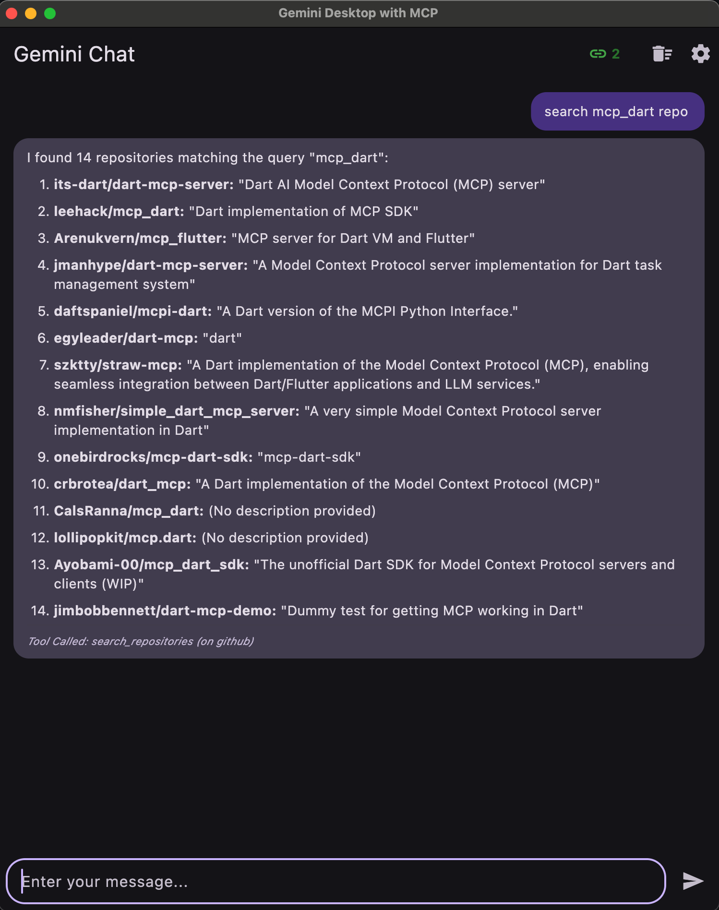
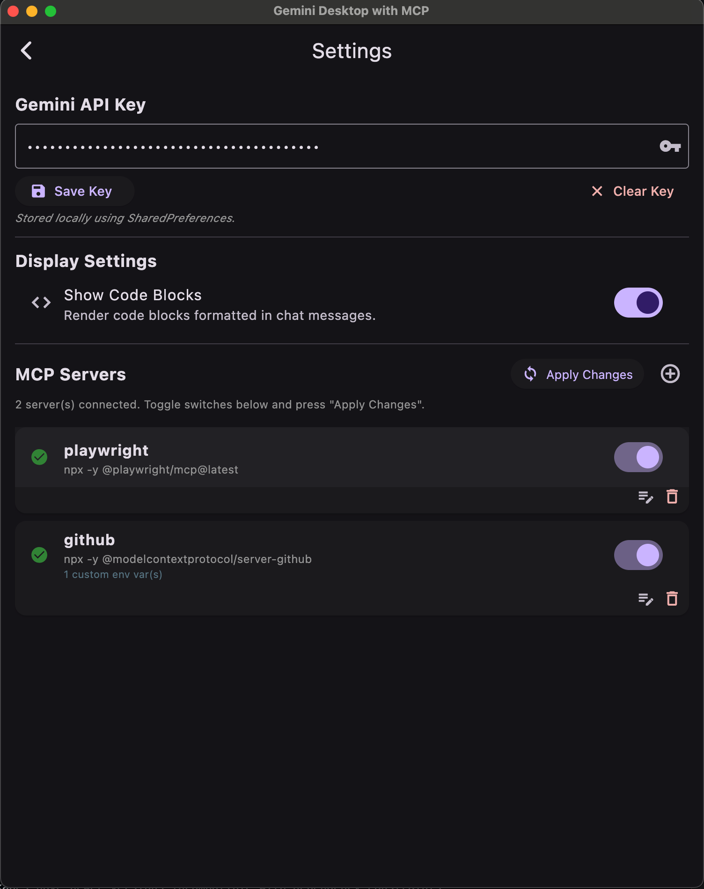
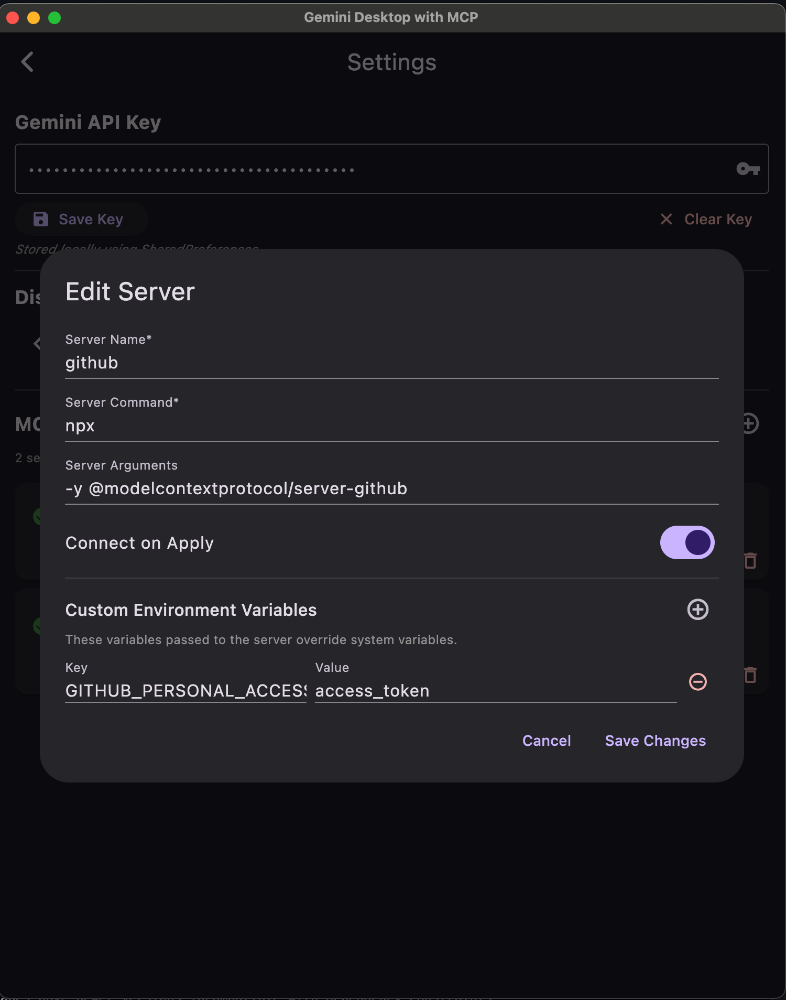

# Flutter + dart_mcp + AI Desktop App Demo

This is a Flutter-based project designed to manage and configure MCP (Multi-Connection Protocol) servers. The application provides a user-friendly interface for managing API keys, configuring server settings, and handling custom environment variables. The application uses the [mcp_dart](https://pub.dev/packages/mcp_dart) package to facilitate communication with MCP servers.

## Screenshots

<p align="center">
  
  
  
</p>

## Features

- **API Key Management**: Save, clear, and manage API keys securely using `SharedPreferences`.
- **MCP Server Management**:
  - Add, edit, and delete MCP server configurations.
  - Toggle server connection states.
  - Apply changes to synchronize server connections.
- **Custom Environment Variables**: Define and manage custom environment variables for each server.
- **Display Settings**: Toggle the visibility of code blocks in chat messages.

## Installation

To run this project, ensure you have Flutter SDK installed on your machine. Follow the [guidelines](https://docs.flutter.dev/get-started/install).

1. Clone the repository:

   ```bash
   git clone git@github.com:leehack/flutter-mcp-ai-chat.git
   cd flutter-mcp-ai-chat
   ```

2. Install dependencies:

   ```bash
   flutter pub get
   ```

3. Run the application:

   ```bash
   flutter run
   ```

## Usage

### API Key Management

The API key is necessary to talk to the Gemini model. You can manage your API key through the settings screen. The key can be created from the [Google AI Studio](https://aistudio.google.com/apikey).

1. Navigate to the **Settings** screen.
2. Enter your API key in the provided text field.
3. Click **Save Key** to store the key locally.
4. Use the **Clear Key** button to remove the stored key.

### MCP Server Management

The MCP server management feature allows you to add, edit, and delete server configurations. You can also toggle the connection state of each server. At the moment, the application supports only the stdio based servers. For the example of MCP servers you can find from <https://github.com/modelcontextprotocol/servers>

1. Add a new server by clicking the **Add New MCP Server** button.
2. Fill in the server details, including name, command, arguments, and custom environment variables.
3. Save the server configuration.
4. Toggle the server's connection state using the switch in the server list.
5. Apply changes to synchronize server connections.

### Custom Environment Variables

1. While adding or editing a server, use the **Custom Environment Variables** section to define key-value pairs.
2. Add new variables using the **Add Variable** button.
3. Remove variables using the delete icon next to each variable.

## Contributing

Contributions are welcome! Please follow these steps:

1. Fork the repository.
2. Create a new branch for your feature or bugfix.
3. Commit your changes and push them to your fork.
4. Submit a pull request with a detailed description of your changes.

## License

This project is licensed under the MIT License. See the [LICENSE](LICENSE) file for details.
